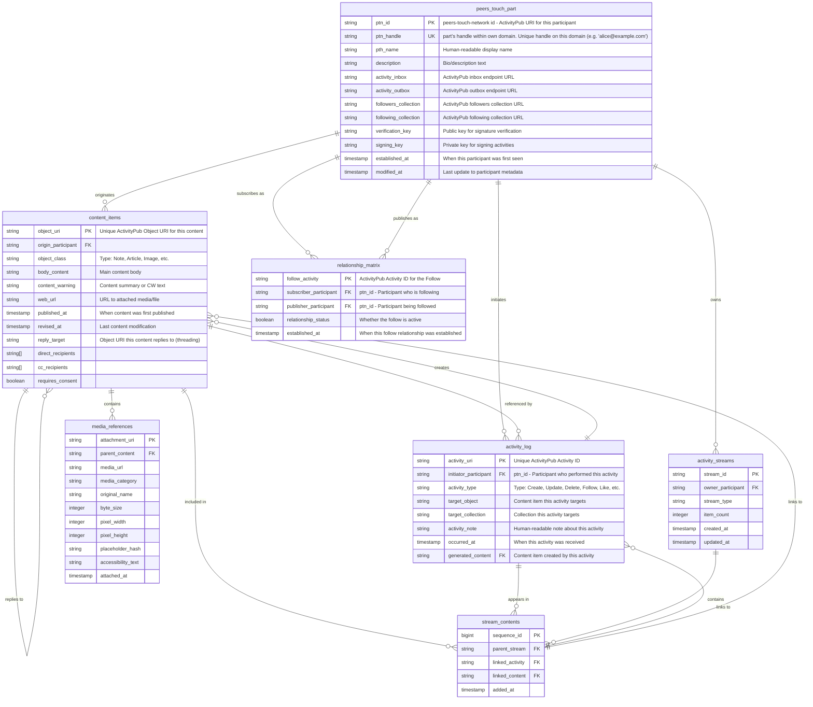

# ActivityPub Database UML Diagram

## Entity Relationship Diagram

## Table Descriptions & Relationships

### Core Entities

#### peers_touch_part
**Purpose**: Master identity registry for all federation participants
- **Primary Key**: `canonical_id` (ActivityPub URI)
- **Unique**: `local_handle` (must be unique per domain)
- **Relationships**:
  - One participant can originate many `content_items`
  - One participant can initiate many `activity_log` entries
  - One participant can be both subscriber and publisher in `relationship_matrix`
  - One participant owns multiple `activity_streams`

#### content_items
**Purpose**: Federated content objects (posts, articles, etc.)
- **Primary Key**: `object_uri` (ActivityPub Object ID)
- **Foreign Keys**:
  - `origin_participant` → `participant_registry.canonical_id`
  - `reply_target` → `content_items.object_uri` (self-referencing for threading)
- **Relationships**:
  - Many content items can reply to one parent content item
  - One content item can have many media attachments
  - One content item can appear in many collection streams

#### activity_log
**Purpose**: Chronological record of all ActivityPub activities
- **Primary Key**: `activity_uri` (ActivityPub Activity ID)
- **Foreign Keys**:
  - `initiator_participant` → `participant_registry.canonical_id`
  - `generated_content` → `content_items.object_uri` (for Create activities)
- **Relationships**:
  - One activity can create one content item (Create activities)
  - One activity can appear in many collection streams

#### relationship_matrix
**Purpose**: Follow relationships between participants
- **Primary Key**: `follow_activity` (ActivityPub Activity ID)
- **Foreign Keys**:
  - `subscriber_participant` → `participant_registry.canonical_id`
  - `publisher_participant` → `participant_registry.canonical_id`
- **Unique Constraint**: `(subscriber_participant, publisher_participant)` prevents duplicate follows
- **Relationships**: Represents asymmetric relationships between participants

### Collection Management

#### activity_streams
**Purpose**: ActivityPub collections (inbox, outbox, followers, following)
- **Primary Key**: `stream_id` (composite of owner + type)
- **Foreign Key**: `owner_participant` → `participant_registry.canonical_id`
- **Unique Constraint**: `(owner_participant, stream_type)` ensures one collection per type per owner
- **Relationships**: Each participant has exactly 4 standard collections

#### stream_contents
**Purpose**: Items within ActivityPub collections
- **Primary Key**: `sequence_id` (auto-incrementing for ordering)
- **Foreign Keys**:
  - `parent_stream` → `activity_streams.stream_id`
  - `linked_activity` → `activity_log.activity_uri`
  - `linked_content` → `content_items.object_uri`
- **Check Constraint**: Ensures exactly one of `linked_activity` or `linked_content` is populated
- **Relationships**: Links activities and content to their containing collections

### Media Management

#### media_references
**Purpose**: Media attachments for content items
- **Primary Key**: `attachment_uri` (ActivityPub Object ID)
- **Foreign Key**: `parent_content` → `content_items.object_uri`
- **Relationships**: One content item can have many media attachments

## Cardinality Summary

| Relationship Type | Description |
|------------------|-------------|
| 1:N | One participant originates many content items |
| 1:N | One participant initiates many activities |
| 1:N | One participant owns many activity streams |
| N:M | Many-to-many follows via relationship_matrix |
| 1:N | One content item has many media attachments |
| 1:N | One activity stream contains many stream contents |
| 1:1 | One Create activity creates one content item |

## Index Strategy

### Primary Access Patterns
1. **Participant Lookup**: `canonical_id` (PK) and `local_handle` (UK)
2. **Content Timeline**: `origin_participant` + `published_at DESC`
3. **Activity Feed**: `initiator_participant` + `occurred_at DESC`
4. **Thread Navigation**: `reply_target` for conversation threading
5. **Collection Items**: `parent_stream` + `added_at DESC` for pagination

### Performance Considerations
- All foreign keys are indexed automatically
- Composite indexes needed for common query patterns
- `sequence_id` in stream_contents provides stable ordering for pagination
- Array fields (`direct_recipients`, `cc_recipients`) require GIN indexes for efficient querying