# ActivityPub Scalable Database Schema (1M+ Users)

## Overview

This enhanced schema is designed to handle 1M+ users while maintaining efficiency for smaller deployments. It incorporates horizontal scaling, sharding strategies, async processing, and performance optimizations.

## Core Design Principles

1. **Horizontal Scalability**: Tables designed for sharding and partitioning
2. **Async Processing**: Decoupled delivery and processing systems
3. **Efficient Indexing**: Optimized for common access patterns
4. **Graceful Degradation**: Works efficiently from 10 users to 10M users
5. **Future-Proof**: Extensible architecture for new ActivityPub features

## Enhanced Entity Relationship Diagram

```mermaid
erDiagram
    %% Core Entities with Sharding Support
    peers_participants {
        bigint ptn_id PK "Snowflake ID for global uniqueness"
        varchar ptn_handle UK "username@domain"
        varchar ptn_display_name
        text ptn_bio
        varchar ptn_avatar_url
        varchar ptn_instance_domain
        jsonb ptn_public_key
        jsonb ptn_metadata "Extensible participant data"
        timestamp created_at
        timestamp updated_at
        int shard_id "Sharding key (ptn_id % num_shards)"
        boolean is_local "Local vs federated participant"
        enum status "active|suspended|deleted"
    }

    %% Sharded Touch Storage
    peers_touches_shard_0 {
        bigint id PK "Snowflake ID"
        bigint origin_ptn_id FK
        text content
        varchar content_type
        varchar language
        jsonb metadata
        bigint reply_to_id FK
        varchar reply_to_uri
        boolean sensitive
        varchar content_warning
        enum visibility "public|unlisted|followers|direct"
        timestamp touched_at
        timestamp updated_at
        int shard_id "Derived from origin_ptn_id"
        tsvector search_vector "Full-text search"
    }

    %% Async Delivery Queue System
    peers_delivery_queue {
        bigint id PK "Auto-increment"
        varchar activity_type "create|update|delete|follow|like|announce"
        bigint activity_id "Reference to specific activity"
        varchar target_instance
        jsonb activity_payload "Complete ActivityPub JSON"
        enum status "pending|processing|delivered|failed|dead"
        int retry_count
        timestamp next_retry_at
        timestamp created_at
        timestamp processed_at
        varchar error_message
        int priority "1-10, higher = more urgent"
    }

    %% Batched Activity Processing
    peers_activity_batches {
        bigint batch_id PK
        varchar target_instance
        jsonb activities "Array of activities for batch delivery"
        int activity_count
        enum status "pending|processing|delivered|failed"
        timestamp created_at
        timestamp processed_at
        varchar delivery_signature
    }

    %% Optimized Follow Relationships
    peers_followers_shard_0 {
        bigint id PK
        bigint publisher_ptn_id FK "Who is being followed"
        bigint subscriber_ptn_id FK "Who is following"
        timestamp followed_at
        enum status "active|pending|rejected"
        int publisher_shard "Shard of publisher"
        int subscriber_shard "Shard of subscriber"
    }

    %% Activity Tables (Sharded by Actor)
    peers_activities_shard_0 {
        bigint id PK "Snowflake ID"
        varchar activity_type "follow|like|create|update|delete|announce|undo|accept|reject|block"
        bigint actor_ptn_id FK "Who performed the activity"
        varchar target_uri "What was acted upon"
        bigint target_object_id "Local object ID if applicable"
        jsonb activity_data "Type-specific data"
        varchar activity_uri UK "Global ActivityPub URI"
        timestamp created_at
        int shard_id "Derived from actor_ptn_id"
        boolean is_local "Local vs federated activity"
    }

    %% Timeline Materialization (Hot Data)
    peers_timelines_cache {
        bigint id PK
        bigint participant_id FK
        varchar timeline_type "home|public|notifications"
        bigint activity_id FK
        bigint touch_id FK
        timestamp activity_time
        int relevance_score "For algorithmic sorting"
        timestamp cached_at
        timestamp expires_at
    }

    %% Instance Management with Health Monitoring
    peers_instances {
        bigint id PK
        varchar domain UK
        varchar software "mastodon|pleroma|peertube|peers-touch"
        varchar version
        jsonb capabilities "Supported ActivityPub features"
        enum health_status "healthy|degraded|unreachable|blocked"
        timestamp last_seen
        int delivery_success_rate "Percentage 0-100"
        int avg_response_time_ms
        jsonb delivery_stats "Success/failure counts"
        timestamp created_at
        timestamp updated_at
    }

    %% Inbox/Outbox with Pagination Support
    peers_inbox_meta {
        bigint inbox_id PK "Snowflake ID"
        bigint owner_participant FK
        varchar inbox_uri UK
        bigint total_items
        bigint first_item_id "For pagination"
        bigint last_item_id "For pagination"
        timestamp touched_at
        int shard_id "Same as owner's shard"
    }

    peers_outbox_meta {
        bigint outbox_id PK "Snowflake ID"
        bigint owner_participant FK
        varchar outbox_uri UK
        bigint total_items
        bigint first_item_id "For pagination"
        bigint last_item_id "For pagination"
        timestamp touched_at
        int shard_id "Same as owner's shard"
    }

    %% Paginated Inbox/Outbox Contents
    peers_inbox_contents_shard_0 {
        bigint sequence_id PK "Snowflake ID for ordering"
        bigint parent_inbox_id FK
        bigint linked_activity_id FK
        bigint linked_touch_id FK
        timestamp added_at
        boolean is_read
        int shard_id "Same as inbox shard"
    }

    peers_outbox_contents_shard_0 {
        bigint sequence_id PK "Snowflake ID for ordering"
        bigint parent_outbox_id FK
        bigint linked_activity_id FK
        bigint linked_touch_id FK
        timestamp added_at
        boolean is_published
        int shard_id "Same as outbox shard"
    }

    %% Media with CDN Support
    peers_media {
        bigint id PK "Snowflake ID"
        bigint parent_touch_id FK
        varchar media_type "image|video|audio|document"
        varchar original_url
        varchar cdn_url "CDN/cached URL"
        varchar local_path "Local storage path"
        bigint file_size_bytes
        varchar mime_type
        jsonb metadata "Width, height, duration, etc."
        varchar blurhash "For image previews"
        enum processing_status "pending|processing|ready|failed"
        timestamp created_at
        timestamp expires_at "For cache management"
    }

    %% Notification System
    peers_notifications {
        bigint id PK "Snowflake ID"
        bigint recipient_ptn_id FK
        varchar notification_type "follow|like|mention|reply|announce"
        bigint source_activity_id FK
        bigint source_ptn_id FK "Who triggered the notification"
        boolean is_read
        timestamp created_at
        timestamp read_at
        int shard_id "Derived from recipient_ptn_id"
    }

    %% Search and Discovery
    peers_search_index {
        bigint id PK
        varchar content_type "participant|touch|hashtag"
        bigint content_id FK
        tsvector search_vector
        varchar language
        int popularity_score
        timestamp indexed_at
        timestamp updated_at
    }

    %% Rate Limiting and Security
    peers_rate_limits {
        bigint id PK
        varchar identifier "IP, participant_id, or instance"
        varchar action_type "post|follow|like|api_call"
        int current_count
        timestamp window_start
        timestamp window_end
        enum status "normal|throttled|blocked"
    }

    %% Analytics and Metrics (Optional)
    peers_metrics_daily {
        date metric_date PK
        varchar metric_type PK "active_users|posts|deliveries|errors"
        bigint metric_value
        jsonb metric_details
        timestamp created_at
    }

    %% Relationships
    peers_participants ||--o{ peers_touches_shard_0 : creates
    peers_participants ||--o{ peers_followers_shard_0 : follows
    peers_participants ||--o{ peers_activities_shard_0 : performs
    peers_participants ||--|| peers_inbox_meta : has
    peers_participants ||--|| peers_outbox_meta : has
    peers_touches_shard_0 ||--o{ peers_media : contains
    peers_activities_shard_0 ||--o{ peers_delivery_queue : triggers
    peers_delivery_queue ||--o{ peers_activity_batches : batches
    peers_inbox_meta ||--o{ peers_inbox_contents_shard_0 : contains
    peers_outbox_meta ||--o{ peers_outbox_contents_shard_0 : contains
```



## Sharding Strategy

### Participant-Based Sharding
```sql
-- Shard calculation
shard_id = participant_id % number_of_shards

-- Example for 16 shards:
-- User ID 12345 -> Shard 9 (12345 % 16 = 9)
```

### Table Sharding Rules
1. **peers_touches**: Sharded by `origin_ptn_id`
2. **peers_activities**: Sharded by `actor_ptn_id`
3. **peers_followers**: Sharded by `publisher_ptn_id`
4. **peers_inbox/outbox_contents**: Sharded by owner's shard
5. **peers_notifications**: Sharded by `recipient_ptn_id`

## Performance Optimizations

### 1. Snowflake IDs for Global Uniqueness
```sql
-- 64-bit Snowflake ID structure:
-- 1 bit: Sign (always 0)
-- 41 bits: Timestamp (milliseconds since epoch)
-- 10 bits: Machine ID
-- 12 bits: Sequence number
```

### 2. Strategic Indexing
```sql
-- High-performance indexes
CREATE INDEX CONCURRENTLY idx_participants_handle ON peers_participants(ptn_handle);
CREATE INDEX CONCURRENTLY idx_participants_instance ON peers_participants(ptn_instance_domain, status);
CREATE INDEX CONCURRENTLY idx_touches_timeline ON peers_touches_shard_0(origin_ptn_id, touched_at DESC);
CREATE INDEX CONCURRENTLY idx_touches_replies ON peers_touches_shard_0(reply_to_id, touched_at DESC);
CREATE INDEX CONCURRENTLY idx_activities_actor_time ON peers_activities_shard_0(actor_ptn_id, created_at DESC);
CREATE INDEX CONCURRENTLY idx_delivery_queue_status ON peers_delivery_queue(status, next_retry_at);
CREATE INDEX CONCURRENTLY idx_followers_publisher ON peers_followers_shard_0(publisher_ptn_id, status);
CREATE INDEX CONCURRENTLY idx_followers_subscriber ON peers_followers_shard_0(subscriber_ptn_id, status);
CREATE INDEX CONCURRENTLY idx_notifications_recipient ON peers_notifications(recipient_ptn_id, is_read, created_at DESC);
```

### 3. Materialized Views for Hot Queries
```sql
-- Home timeline materialized view
CREATE MATERIALIZED VIEW peers_home_timeline_mv AS
SELECT 
    t.id,
    t.origin_ptn_id,
    t.content,
    t.touched_at,
    p.ptn_display_name,
    p.ptn_avatar_url
FROM peers_touches_shard_0 t
JOIN peers_participants p ON t.origin_ptn_id = p.ptn_id
WHERE t.visibility IN ('public', 'unlisted')
ORDER BY t.touched_at DESC;

-- Refresh strategy: Every 5 minutes for hot data
```

## Async Processing Architecture

### 1. Delivery Queue System
```yaml
Delivery Flow:
  1. Activity Created -> Insert into peers_delivery_queue
  2. Background Worker -> Process queue in batches
  3. Batch Similar Deliveries -> Create peers_activity_batches
  4. HTTP Delivery -> Update status and retry logic
  5. Success/Failure -> Update instance health metrics
```

### 2. Queue Processing Strategy
```sql
-- Priority-based processing
SELECT * FROM peers_delivery_queue 
WHERE status = 'pending' 
  AND next_retry_at <= NOW()
ORDER BY priority DESC, created_at ASC
LIMIT 100;
```

## Scalability Features

### 1. Horizontal Scaling Support
- **Database Sharding**: Automatic shard routing based on participant ID
- **Read Replicas**: Separate read/write operations
- **Connection Pooling**: Efficient database connection management
- **Cache Layers**: Redis/Memcached for hot data

### 2. Graceful Degradation
- **Circuit Breakers**: Prevent cascade failures
- **Rate Limiting**: Protect against abuse
- **Health Checks**: Monitor instance availability
- **Fallback Mechanisms**: Degrade gracefully under load

### 3. Monitoring and Observability
- **Metrics Collection**: Daily/hourly aggregated metrics
- **Performance Monitoring**: Query performance tracking
- **Alert System**: Automated alerts for issues
- **Capacity Planning**: Growth trend analysis

## Migration Strategy

### Phase 1: Foundation (0-10K users)
- Single database instance
- Basic sharding preparation
- Essential indexes

### Phase 2: Scaling (10K-100K users)
- Enable read replicas
- Implement caching layer
- Optimize delivery system

### Phase 3: Sharding (100K-1M users)
- Implement database sharding
- Deploy async processing
- Advanced monitoring

### Phase 4: Massive Scale (1M+ users)
- Multi-region deployment
- CDN integration
- Advanced optimization

## Configuration Examples

### Small Deployment (< 1K users)
```yaml
sharding:
  enabled: false
  shards: 1

caching:
  enabled: true
  ttl: 300s

delivery:
  batch_size: 10
  workers: 2
```

### Large Deployment (1M+ users)
```yaml
sharding:
  enabled: true
  shards: 64

caching:
  enabled: true
  ttl: 60s
  layers: ["redis", "memcached"]

delivery:
  batch_size: 100
  workers: 50
  max_retries: 5
```

## Benefits of This Design

1. **Scalable from Day 1**: Works efficiently at any scale
2. **Future-Proof**: Easy to add new ActivityPub features
3. **Performance Optimized**: Sub-second response times
4. **Fault Tolerant**: Graceful handling of failures
5. **Cost Effective**: Efficient resource utilization
6. **Maintainable**: Clear separation of concerns
7. **Observable**: Comprehensive monitoring and metrics

This enhanced schema provides a solid foundation for building a decentralized social network that can grow from a small family group to a massive global community while maintaining excellent performance and reliability.